# GA SEI Project 4 - Stock Forum

**Project Link:** https://stock-forum-app.herokuapp.com/

## Overview

This project was completed in fulfilment of the project 4 assignment on General Assembly’s Software Engineering Immersive course. The project built was a forum for users to post their investment theses for buying or selling specific stocks. Users can register/ login and search and filter for specific threads in the forum and post a comment and engage in discussion on individual threads. This was a solo project and involved writing code in a web framework that I had no experience in so I felt a little out of my depth at first but my confidence grew throughout and I was pleased with the project I had built by the deadline. In terms of the development process for this project, I first began with the planning by completing a wireframe, an ERD, and a project workflow to establish exactly what needed to be built and in what order. Following this, I created the repository and began writing the project code. The final step in the build of the project was deploying the codebase using Heroku.

## Tech used:

- **Frontend:** HTML, CSS, React, Bootstrap, SASS, Axios
- **Backend:** Django, Python, PostgreSQL, TablePlus
- **Other:** Figma, Trello, Excalidraw, Heroku

## Planning

After I thought about what I wanted to build for this project I came up with the idea of a stock forum for users to share their investment ideas about different companies and engage in discussion. This project idea is great for me as finance and the stock market is a topic that interests me and it would therefore be an enjoyable process to build out this project idea. Once the idea was established, I began writing down a project workflow of exactly what needed to be done and in what order - as displayed below. This would mean that I could use the planning documents in the wireframe and ERD to help aid the development process of the project.

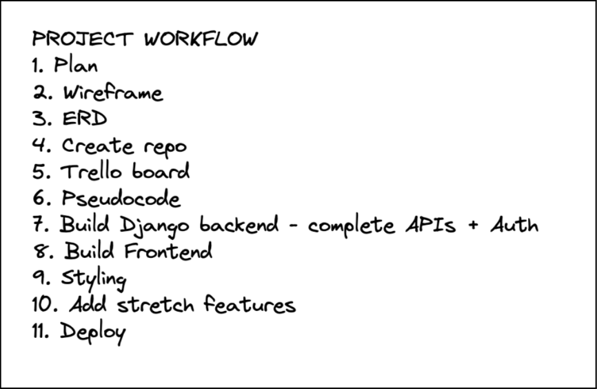

After coming up with a project workflow, I then began designing the wireframe using the Excalidraw tool. Wireframing the project is for me the most crucial step in the planning process as it allows me to visualise what the project frontend is going to look like and what API connections are going to be needed from the backend.

The project wireframe displayed below shows the seven individual project pages. In order from Left→Right and Top→Bottom we have the landing page which shows a welcome banner and a button to enter the forum threads index page where users can search/filter for specific threads. Next, we have register and login pages which simply display the relevant forms and required inputs for the collection of user data with also form submission buttons. Next on the second row, there is the thread single page which displays all the information and discussion for an individual thread. The last two pages displayed in the wireframe are the thread add and thread update pages which allow a user to add a new thread and update the existing thread that they own.

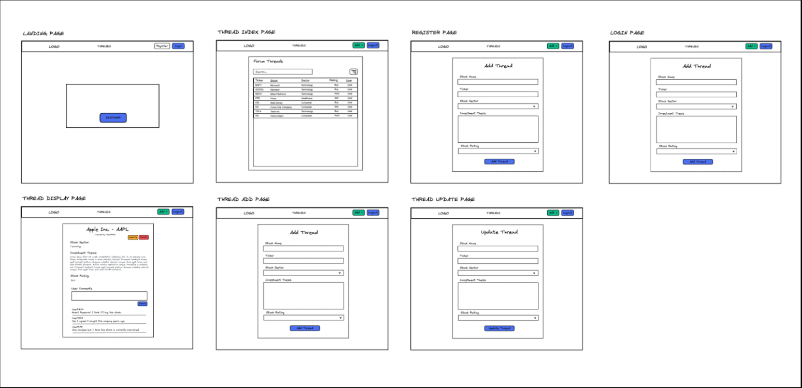

Another diagram that was created as part of the planning process was the ERD. Completing this allowed me to better understand the system requirements for the SQL database and the Django web server by designing the db models and relationships. As displayed below, I used three separate db tables which were for the Users, Threads, and Comments. The relationships between the tables involved one-to-many connections between the Users and Threads, Users and Comments, and Threads and Comments.

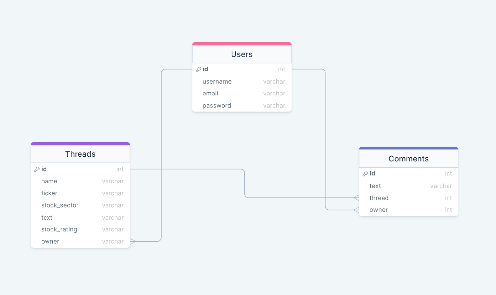

## Coding

After the planning of the project was completed and I knew exactly what needed to be built and in what order, the process of coding began. I first created a Trello board to manage the development process of the project - which is displayed below. In doing this I added many cards to the board which each represented an individual page, feature, or component of the project build. I then created various lists to represent the stages of my progress in the development of an individual component or feature. I also added coloured tags to some of the cards to represent frontend or backend components. This board was very helpful and was a great visual representation of progress, allowing me to know whether I was on track for the project deadline.

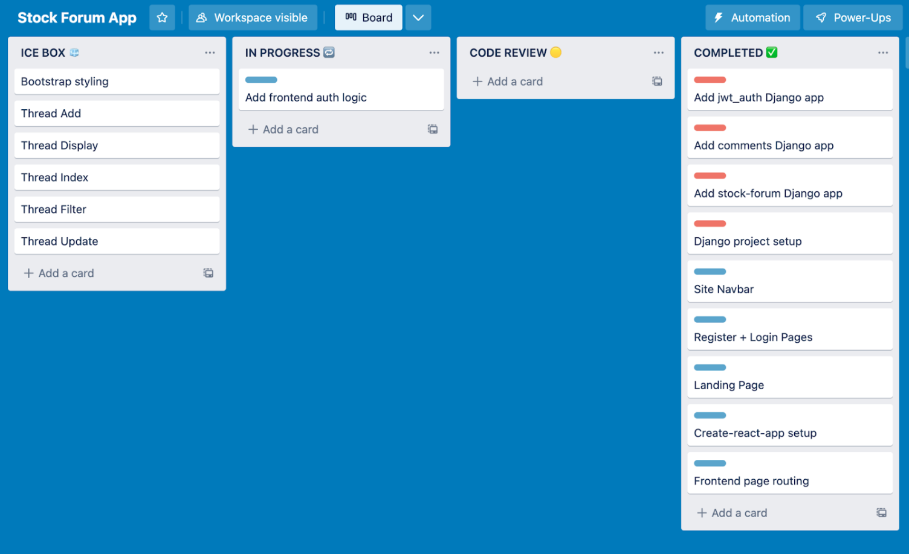

**Code Snippets:**

The featured code snippet shows the Python code written in the Django web framework and depicts the logic for two of the main pages of the project. In the first snippet, the thread index page code is displayed, then in the second the individual thread and discussion page code is displayed. These pages use the Django Rest Framework to send and receive data from various API endpoints.

In the first code snippet, on the page load code is executed to perform a get request which will return data for all current threads in the database, but if unsuccessful an error message will be returned. Additionally, the second chunk of code in this snippet represents a post request to the database which includes data to create a new thread and data on the owner of the thread - which is the user making the request. This code is linked to an ‘add thread” button and is executed when a form is completed and the form submission button is clicked. If this request fails, an error message is returned with an error code.

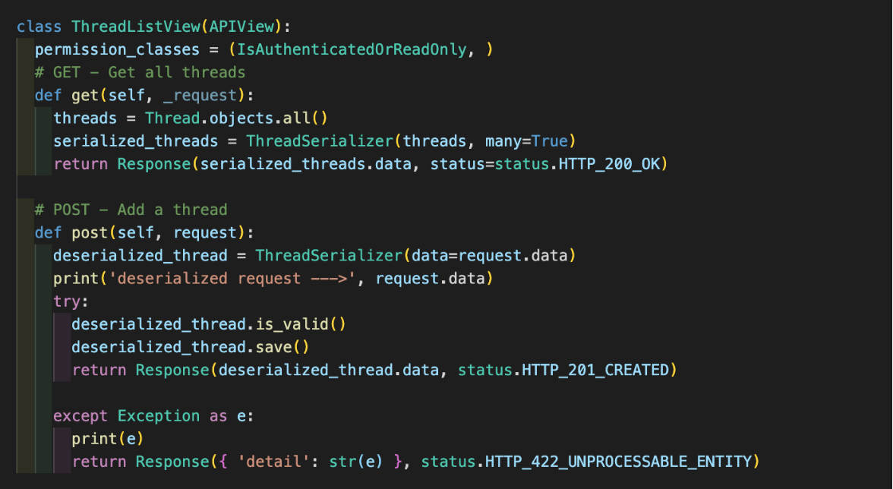

The second code snippet represents the API calls being made from the individual thread pages. This shows Python logic for three different API requests made on this page. Firstly we have a get request which returns data on a specific forum thread based on its primary key. Then we have a delete request which allows the owner to delete their thread at the click of a button which calls the function to find a thread in the db by its primary key and delete it. Lastly, we have a put request which allows the owner of a thread to update the thread data of a specific thread. Similarly, this is connected to an ‘update’ button which takes the user to an update thread page where they can edit data, and then on the click of the form submission button the function is called, and put request is made to the Django web server. As we previous functions, if these requests fail an error message will be returned with an error code.

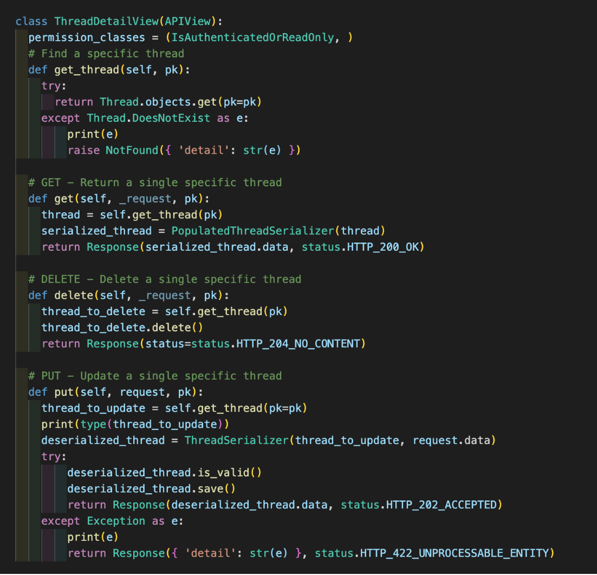

Here is a screenshot of the forum index page which displays all forum threads and allows users to search/filter for their desired thread. Furthermore, the logic displayed in the first code snippet which is responsible for getting all threads is utilised on this page.

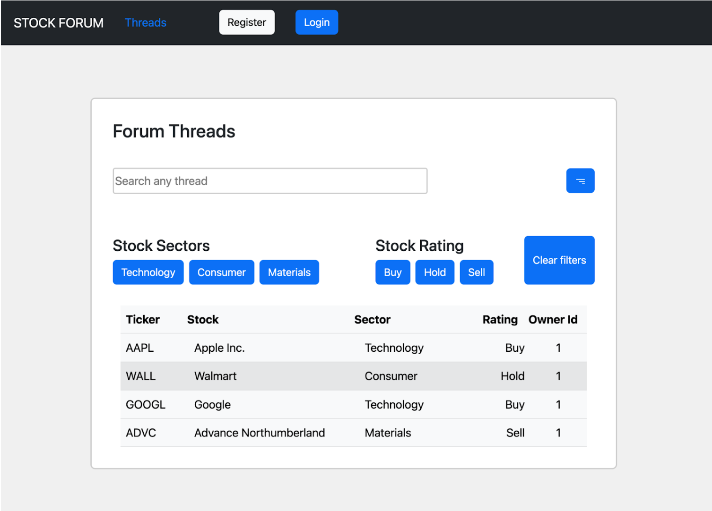

## User Authentication

The user authentication system is another important part of this project as it allows users to register with a username, email, and password which they can use to login and have access to the site's main features. Logged-in users have permission to add new forum threads to share their investment idea and they have permission to leave comments on other users’ threads to engage in discussion. Some of the pieces of code that make up the user authentication system are explained below.

**models.py**

The snippet below is the models.py file which establishes the type of data being stored in the database. In this case, we have two bits of data which are the username and email which both are CharField types, having a max length of 50 characters and both will be unique values.

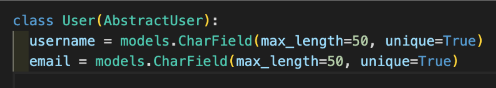

## Authentication.py

The next step in building the user authentication system was to develop the auth middleware which is displayed in the authentication.py code snippet. Here we can see the user model being imported as well as the Basic Authentication, PermissionDenied, and JWT packages. The logic in this code snippet determines if a user request has been sent with an access token. In doing this task the code will decode the bearer token in the headers of the request using JWT and the secret key stored in the settings.py file and determine if the payload/token is valid. If the token is valid then return with user data. If the token is found to be not valid or if it fails any of the checks then an error message is raised through the PermissionDenied package. This authentication logic can then be imported into other components or parts of the project to easily authenticate users.

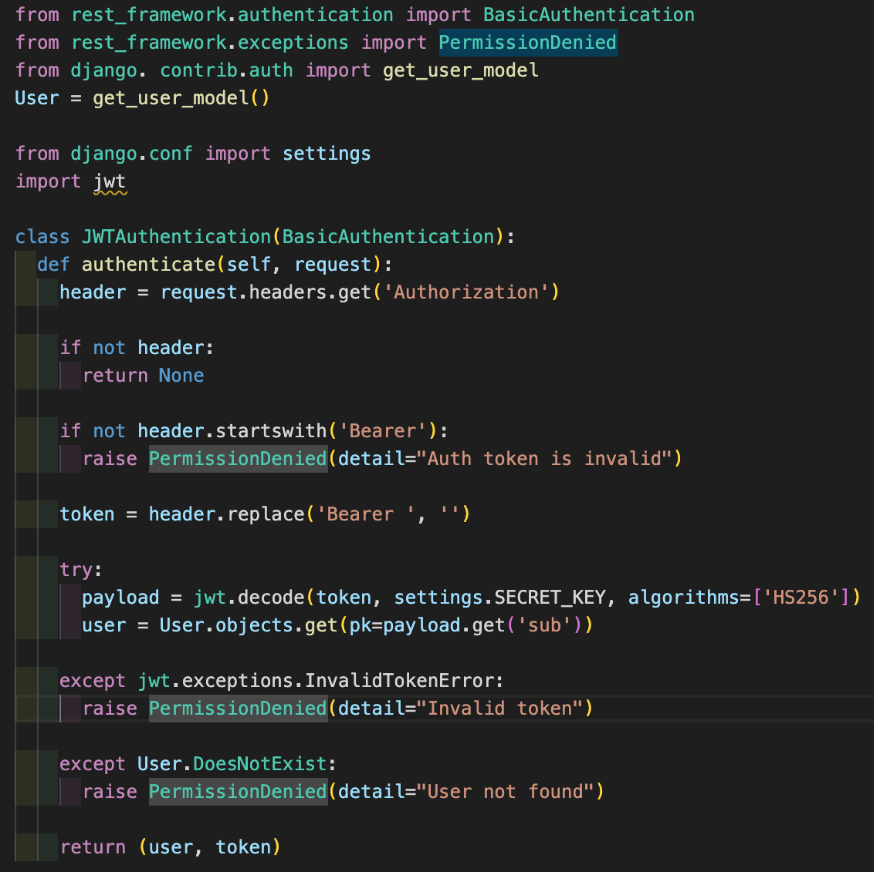

**views.py**

The views.py file contains the logic that allows users to send requests and receive responses to and from the backend system and the database with the help of API endpoints. The logic in this file is split into two parts that each do different tasks.

This first code snippet shows the logic for when a new user sends a request to the backend system to register the user’s details into the database. The logic chain for this snippet is as follows: user request is sent to the backend, and the new user data is received from the request body and is checked against the database to determine if a user with the same email address already exists. If this email address is already in use by a current user an error status and message are returned. The same check is completed with the new user’s username. If the user’s email and username are both unique the code will then check to see if the new user’s password and confirmPassword are a match, if not an error is returned. Once these checks are completed and passed, the user’s password is encrypted and stored in the database and a success status is returned to the frontend to let the user know they have registered.

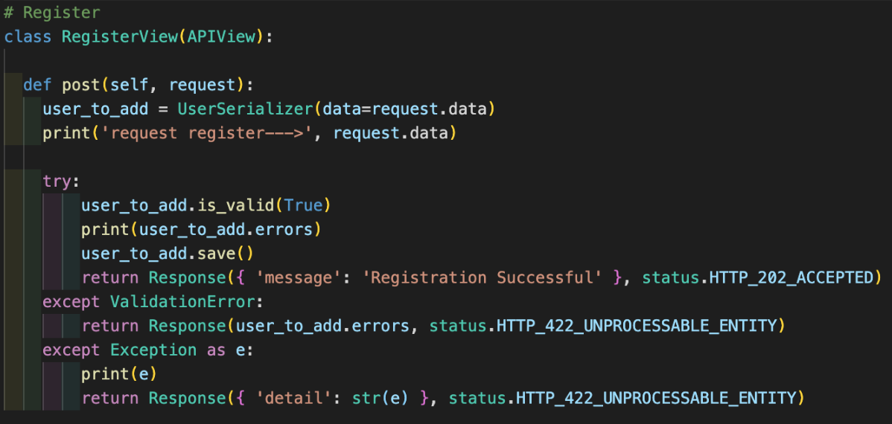

The next code snippet displays the logic to perform the logging-in of the user. The chain of logic is as follows: a user sends a login request to the backend, and the code will get the email and password data from the request data. This data is then used to find the user in the user database. If no user is found or the user details are incorrectly inputted, then an error status and message are returned. If a user is successfully found then a token is created with the user’s details. This payload is used in combination with an expiry date/time and JWT secret to create a JWT token which is returned to the user providing them with authentication to sign in and allowing access to various protected routes on the website.

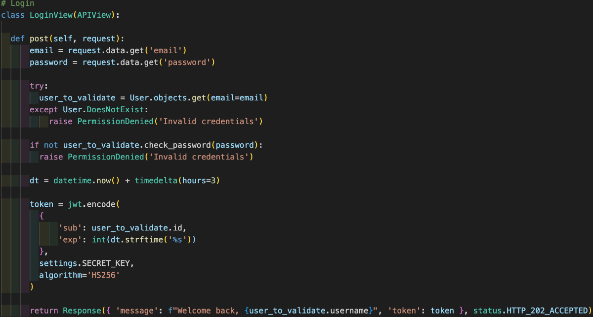

**urls.py**

The code snippet below displays the URL paths for the previously explained RegisterView and LoginView.

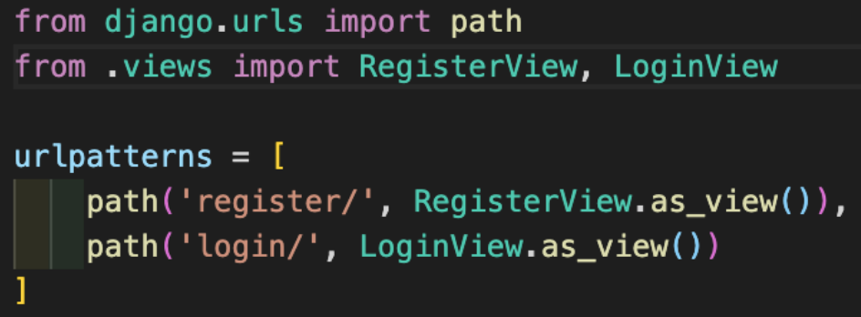

**Register and Login**

The two screenshots below display the frontend forms for the user to register or log in to the stock forum app. These represent the frontend part of the user authentication system. The user enters their details into the input fields and presses the submit button. This sends the post request to the backend server which then uses the logic previously discussed to field the request and send a response.

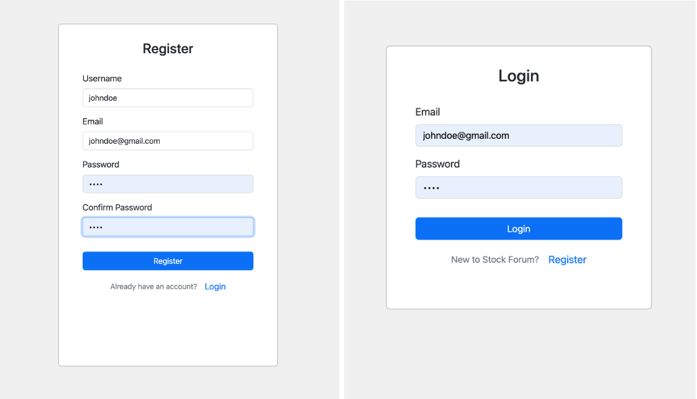

## Project Wins

- Working with Python for web development and using Django and a SQL DB for the first time went quite well. I was initially anxious about using these languages and technologies since I only learnt about them a few weeks prior and had no project experience with them. However, by the end of the project, I was feeling quite comfortable writing code with this stack.
- After working collaboratively on my two previous projects I was pleased with how I adapted to returning to developing a solo project. Working on this project solo allowed me to test my knowledge of full-stack and helped reinforce what I had learnt from my class time with instructors.
- After having a mid-project pivot, the initial plan was adjusted and under time constraints of finishing for the project deadline, I managed to finish the entire frontend of the project in under 8 hours.

## Challenges / Bugs

- This was the most difficult project I completed during the boot camp. The reason for this was due to initially having an idea of what I wanted to do but halfway through the coding process, I realised that it was unachievable within the project deadline. This led me to adapt some of the original plans which meant the project pretty much became a code sprint for the last 48hrs.
- On the thread index page, I didn’t manage to display the user's name in the Owner Id table column to represent the owner of the thread. This bug puzzled me for some time as I found several StackOverflow solutions but nothing seemed to work. In the end, due to time constraints, I changed the column title and moved on.

## Key Learnings

- This was my first time using this technology stack for a project and I learnt quite a lot about these languages/technologies in the process. I now know that Django is great for rapid development and has lots of great pre-built packages for the security and maintainability of the project/app. Also, I learnt how to set up, seed, and operate a SQL database by using PostgreSQL.
- After having to perform a pivot of the project halfway through the development process, I’ve learnt a vital lesson about working on a project that is achievable within the given constraints. Furthermore, I’ve learnt about the importance of being able to perform a pivot and adapt while still achieving the given requirements for the project in the timeframe.

## Future Improvements

- One improvement which I would like to add would be to include live stock price data from a third-party API. This would just be used on the frontend and would use the stock symbols within the threads to dynamically get pricing data on individual stocks.
- I could also add a user profile page to display any threads that a user may have created and all threads they may have interacted with via a comment.
- Another would be to have a Light/Dark theme for the web app that would include having a button on the navbar to easily allow users to switch between the two themes. This would be a simple improvement that is included in most modern web apps but due to time constraints, I didn't manage to build it.
